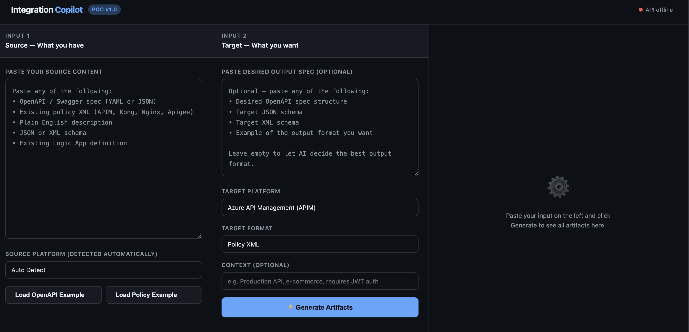
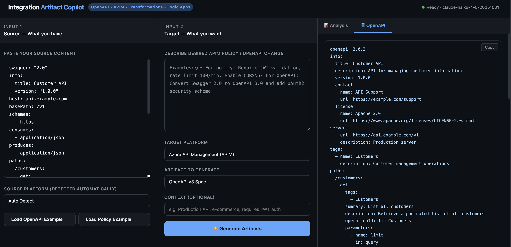
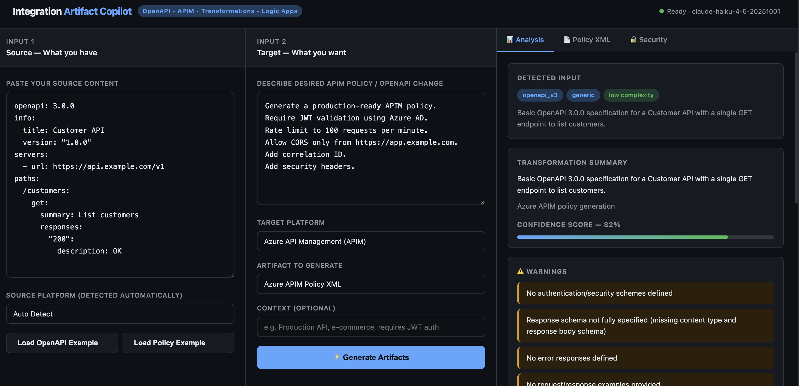
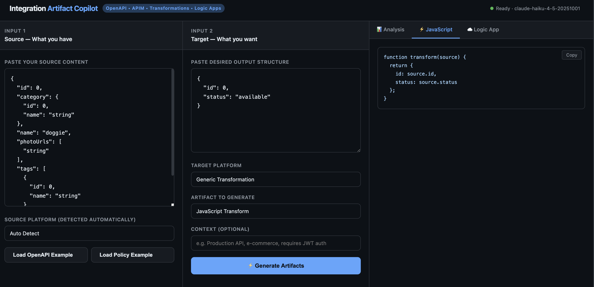
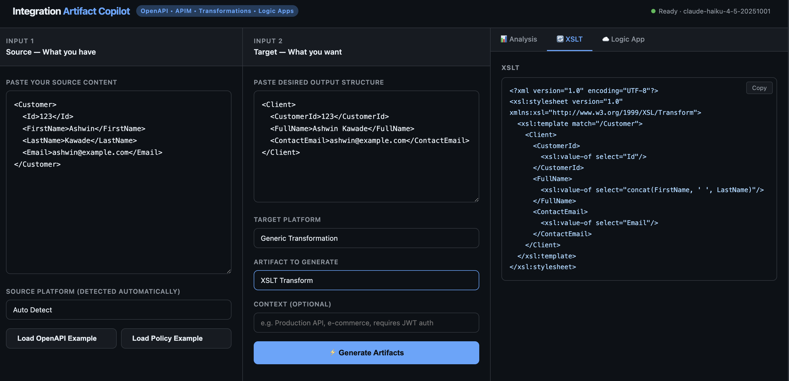
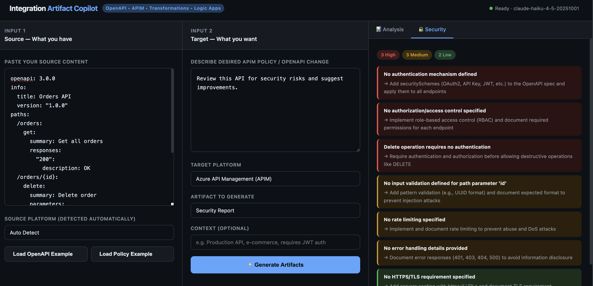
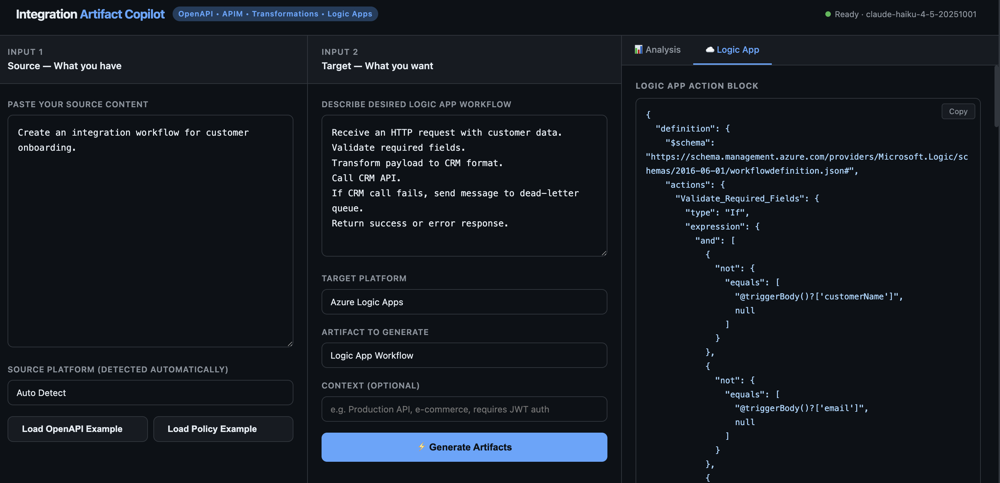

## Live Demo

The application is deployed on Render:

https://integration-artifact-copilot-v1.onrender.com

Health check:

https://integration-artifact-copilot-v1.onrender.com/health

## Home Screen

The main workspace allows users to provide source integration assets, describe the desired outcome, select the target platform, and generate artifacts.

---

## OpenAPI Generation

Generate or upgrade OpenAPI specifications from existing Swagger/OpenAPI definitions and business requirements.

Example capabilities:

- Swagger 2.0 → OpenAPI 3.0 conversion
- Security scheme generation
- Missing schema detection
- API design recommendations

---

## Azure API Management Policy Generation

Generate Azure APIM policies based on OpenAPI specifications and desired API governance requirements.

Supported examples:

- JWT validation
- OAuth2 validation
- Rate limiting
- CORS policies
- Security headers
- Backend routing

---

## JSON Transformation Generation

Generate JavaScript transformation code from source and target payload definitions.

Supported scenarios:

- Field mapping
- Data restructuring
- Payload enrichment
- Logic App inline code generation

---

## XML Transformation Generation

Generate XSLT transformations from source and target XML structures.

Supported scenarios:

- Element mapping
- Namespace handling
- XML restructuring
- Legacy integration support

---

## Security Review

Analyze OpenAPI specifications, API policies, JSON payloads, and XML payloads for security concerns.

Example findings:

- Missing authentication
- Missing authorization
- Missing rate limiting
- Excessive data exposure
- Missing security headers

---

## Logic App Workflow Generation

Generate Azure Logic App workflow artifacts and implementation guidance.

Supported outputs:

- Workflow skeletons
- Inline Code actions
- Connector recommendations
- Integration patterns

